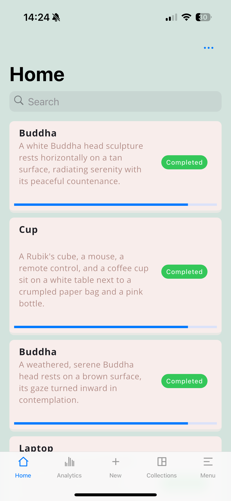
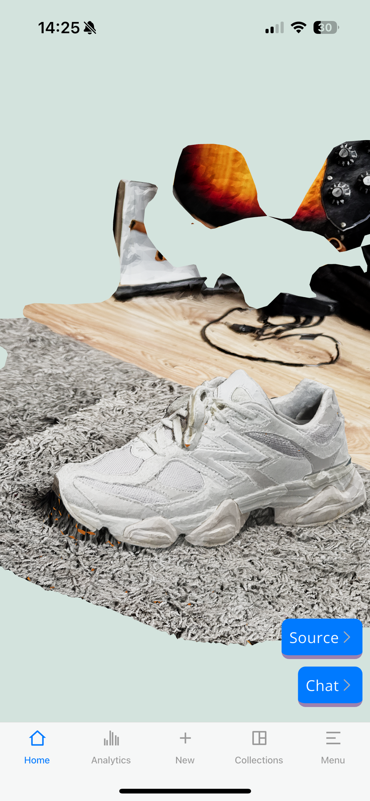
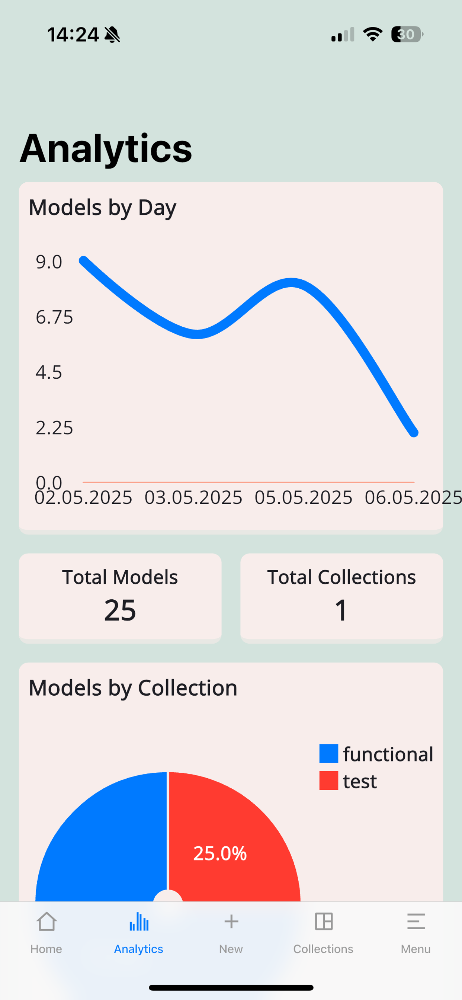
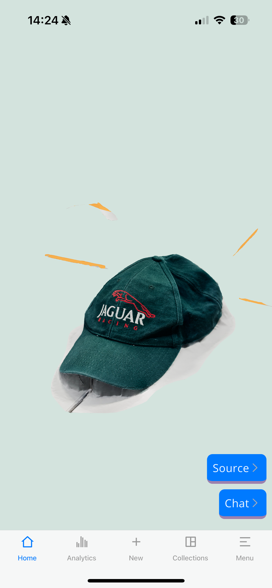

[](https://github.com/2024-dissertation/model-maker-app/actions/workflows/ci.yml)

# Model Maker Frontend

**Note: Fastlane certifications aren't available to anyone outside of the Model Maker organisation. If you'd want to contribute, reach out at [saml@everbit.dev](mailto:saml@everbit.dev)**

#### Preview

<p align="center">
    
    
    
    
</p>

#### Setup

Most of this repo is self contained, however the Firebase Authentication will need to be setup manually.

 - Create a Firebase Project. Reuse this between the App and the API
 - Download `GoogleService-Info.plist` and place in [ios/](ios/)
 - Run with [Flutter](https://flutter.dev/)

The project uses a custom entrypoint:

```flutter
flutter run -t lib/main/main.dart
```

To configure your server address, change `baseUrl` in [lib/helpers/globals.dart](lib/helpers/globals.dart) For stability, also update the test in [test/utils/globals_test.dart](test/utils/globals_test.dart).

#### Tests

To run the tests, run the following command:

```bash
flutter test
```

To generate coverage reports, run the following command:

```bash
flutter test --coverage
```

To convert the report to html, run the following command:

```bash
genhtml coverage/lcov.info -o coverage/html
```

#### CI/CD

This project uses GitHub Actions for CI/CD. The workflow is defined in [.github/workflows/ci.yml](.github/workflows/ci.yml)

Sources
 - https://yayocode.com/codelabs/flutter/flutter_simple_crud_with_firebase_and_cubit/

Special thanks to [Ben Komets](https://www.youtube.com/@benkomets494) for the sample testing image set bundled in this repo: https://www.youtube.com/watch?v=4LexaqdxdiU
